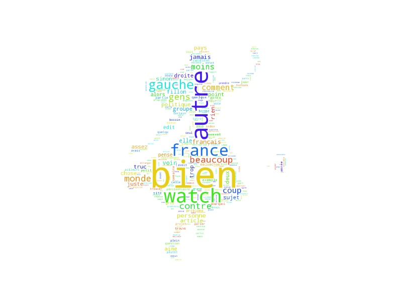

Work in progress 

[Documentation](http://reddit-bot-analysis.readthedocs.io/en/latest/) <- also a work in progress
 
Use Python3 + praw + nltk.

Done
- reddit bot:
  - reddit bot that retrieves posts from a subreddit
  - store those posts in memory with shelve
- analysis:
  - count words appearence in the comments
- presentation
  - wordcloud 

TODO

- analysis:
  - sentiment analysis
  - ?

- presentation
  - build infographics from the results of analysis